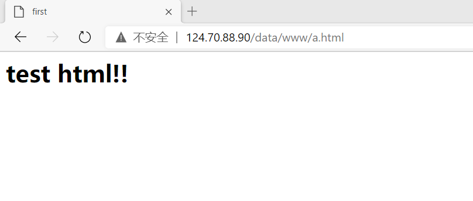

# 动静分离

## 1.动态资源和静态资源的区别

**静态资源**： 当用户多次访问这个资源，资源的源代码永远不会改变的资源。（html、css、img等）
**动态资源**：当用户多次访问这个资源，资源的源代码可能会发送改变。(jsp、servlet等)

## 2.什么是动静分离？

动静分离是让动态网站里的动态网页根据一定规则把不变的资源和经常变的资源区分开来，动静资源做好了拆分以后，我们就可以根据静态资源的特点将其做缓存操作，这就是网站静态化处理的核心思路。

动静分离简单的概括是：动态文件与静态文件的分离。

一般来说，都需要将动态资源和静态资源分开，将静态资源部署在Nginx上，当一个请求来的时候，如果是静态资源的请求，就直接到nginx配置的静态资源目录下面获取资源，如果是动态资源的请求，nginx利用反向代理的原理，把请求转发给后台应用去处理，从而实现动静分离。


## 3.为什么要动静分离？

（1）在使用前后端分离之后，可以很大程度的提升静态资源的访问速度，同时在开发过程中也可以让前后端开发并行，可以有效的提高开发时间，也可以有效的减少联调时间 。

（2）把动态页面和静态页面由不同的服务器来解析，加快解析速度。降低原来单个服务器的压力。

## 4.动静分离实例（准备工作）

实例：使用nginx动静分离，根据访问路径直接获取静态资源

### 1.准备一个img图片和html文件


### 2.将准备的img文件和html文件放入文件夹中

（1）在根目录下创建一个data文件夹

```
cd /      //进入根目录
mkdir data    //创建一个名为data的文件夹
ls            //查看根目录
```

（2）在data夹中创建一个www文件和image文件

```   
cd data   //进入data目录
mkdir image   
mkdir www     //创建image、www文件
ls       //查看data文件夹里wwww和image两个文件夹是否创建成功
```

（3）把准备的img和html文件分别放入image文件和www文件中（直接在可视化目录下拖进即可）

### 3.配置nginx

(1)找到nginx.conf文件并打开

```
cd /usr/local/nginx/   #进入nginx目录
cd conf                  
ls                     #列出conf下的文件
vi nginx.conf          #打开编辑nginx.conf文件
```

（2）编辑修改nginx.conf

```
    server {
        listen       80;
        server_name  124.70.88.90; #将localhost修改为服务器ip地址

        #charset koi8-r;

        #access_log  logs/host.access.log  main;

        location / {
            root   /;    #修改为/，获取资源时从根目录开始
            index  index.html index.htm;
        }
```

（3）重启nginx

进入nginx执行文件目录

```
./nginx #重启nginx
```

## 5.最终结果

在浏览器中输入准备的img文件和html文件路径

http://124.70.88.90./data/image/1.JPG


http://124.70.88.90/data/www/a.html



## 6.可能会遇到的问题

### 1.出现E325界面

出现原因：编辑文件后没有保存就直接关闭终端退出，vim自动创建了一个.swp文件来保存刚刚编辑时未保存的内容


解决方法：

方法一：

输入D（删除交换文件），下次打开就不会出现此页面。

或者是在终端输入ls –la找到.swp文件（这个文件是一个隐藏文件，所以删除时要加上.）

然后再rm –rf .nginx.conf.swp 

这个方法不会恢复数据。

方法二：

输入R（恢复），然后回车，对此文件进行保存、退出。

再次打开这个文件还是会出现E325这个界面

然后再输入D（删除交换文件），就不会出现了E325这个界面了

这个方法可以恢复数据。

### 2.配置location问题

```
        location / {
            root   /;    #修改为/，获取资源时从根目录开始
            index  index.html index.htm;
        }
```

这里root后面跟的是根目录，那么在浏览器访问静态请求时，访问的路径地址需要是该资源的具体位置。否则会出现404页面，无法获取